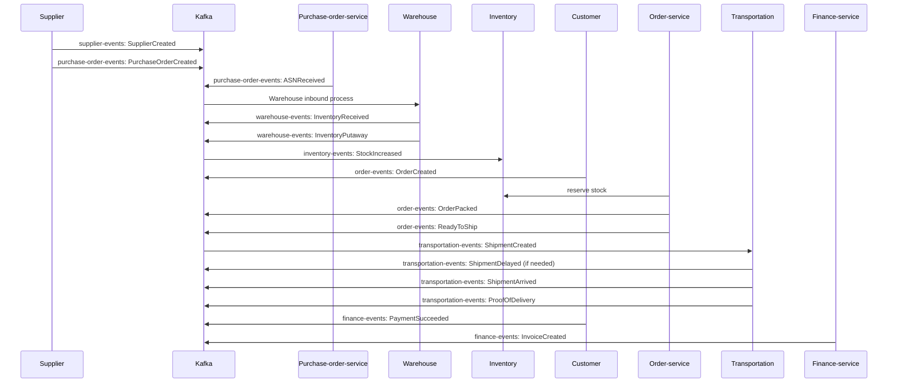

# Executive Summary

We define a comprehensive set of Kafka topics and event types to model the “Daemon Supply Chain” system.  Each topic (e.g. **supplier-events**, **purchase-order-events**, **inventory-events**, **warehouse-events**, **transportation-events**, **order-events**, **customer-events**, **finance-events**, **manufacturing-events**) contains many sub-events that capture fine-grained state changes (for example, *PurchaseOrderCreated*, *OrderDelivered*, *ShipmentDelayed*, etc.).  For each sub-event we specify a precise JSON schema (fields, types, required/optional, format) that includes **foreign keys** and timestamps (e.g. *supplier_id*, *product_id*, *po_id*, *shipment_id*, *warehouse_id*, *order_id*, *customer_id*, *vehicle_id*, *batch_id*, *event_id*, *trace_id*, *event_time*).  We provide sample payloads for each event type (including edge cases like partial shipments or cancellations) and validate them against the schema. Each sub-event also includes a brief rationale: its business meaning, technical design notes (idempotency, partitioning key, retention), and ML/AI use cases (features, possible labels, event frequency). We show an end-to-end event flow diagram (Mermaid sequence) linking key events (PO→ASN→Inbound→Inventory→Order→Outbound→Transportation→Delivery→Invoice). Finally, we outline an integration checklist for producers/consumers (outbox pattern, schema registry, Avro/JSON choice, versioning, error handling, retries, DLQ) with recommended best practices.  

# Kafka Topics and Subevents

We organize events by domain into Kafka topics.  Each topic contains events (sometimes called “sub-events”) relevant to that domain.  Table 1 catalogs the main topics and their sub-event types:

| **Kafka Topic**      | **Sub-event Types**                                                                                     |
|----------------------|---------------------------------------------------------------------------------------------------------|
| **supplier-events**  | SupplierCreated, SupplierUpdated, SupplierShipmentCreated, SupplierShipmentDelivered, SupplierQualityAlert |
| **purchase-order-events** | PurchaseOrderCreated, PurchaseOrderApproved, PurchaseOrderCancelled, ASNReceived                       |
| **inventory-events** | StockIncreased, StockDecreased, InventoryReserved, InventoryReleased, SafetyStockAlert, ReorderTriggered, InventorySnapshot, BackorderCreated, AllocationCreated, AllocationReleased, SKUCreated, SKUDiscontinued |
| **warehouse-events** | InventoryReceived (Goods Receipt), InventoryPutaway, CycleCount, InventoryAdjusted, LocationChanged, DamagedStockReported, ExpiredStockReported, StockTransferred |
| **transportation-events** | ShipmentCreated, VehicleAssigned, DriverAssigned, Loaded, Dispatched, CheckpointReached, ShipmentDelayed, ShipmentArrived, ProofOfDelivery |
| **order-events**     | OrderCreated, PaymentSucceeded, PaymentFailed, OrderConfirmed, OrderPacked, ReadyToShip, OrderCancelled, OrderDelivered, ReturnInitiated, OrderRefunded |
| **customer-events**  | CustomerCreated, AddressUpdated, ComplaintFiled, RatingGiven, SupportTicketOpened, WarrantyClaimSubmitted, FeedbackProvided, LoyaltyPointsUpdated |
| **finance-events**   | InvoiceCreated, InvoicePaid, CreditNoteIssued, DebitNoteIssued, PaymentDue, PaymentCompleted, CostUpdated, RevenuePosted |
| **manufacturing-events** | ProductionStarted, ProductionCompleted, MaterialConsumed, MachineFailureReported, MachineRecovered, QualityInspectionCompleted, ItemRejected, ReworkStarted, FinishedGoodsCreated, BatchClosed |

*Table 1: Kafka topics and their sub-event types.* 

This design follows an **event-driven architecture**: each microservice or domain emits events to a dedicated Kafka topic.  Event names are verbs or actions, and fields inside each event link to related entities (e.g. *order_id*, *supplier_id*).  When producing messages, we’ll assign a **message key** (such as *supplier_id* or *order_id*) so that related events go to the same partition, preserving order per entity.  (Kafka only guarantees ordering within a single partition, so using the right key is critical.)  

# JSON Schemas and Sample Payloads

For each sub-event we define a JSON schema.  Schemas include: 

- A unique `"event_id"` (UUID or similar) for tracking.  
- A `"trace_id"` for correlated tracing across services (optional but recommended).  
- A timestamp field (e.g. `"event_time"`, ISO8601).  
- Foreign keys (`supplier_id`, `order_id`, etc.) to relate to other events/entities.  
- Event-specific fields.  

Below we outline representative schemas with sample payloads. (For brevity we show key fields; in practice include all relevant fields as required.)

## supplier-events

### SupplierCreated

**Schema:** 

```json
{
  "type": "object",
  "properties": {
    "event_id":        { "type": "string", "format": "uuid" },
    "trace_id":        { "type": "string", "format": "uuid" },
    "event_time":      { "type": "string", "format": "date-time" },
    "supplier_id":     { "type": "string", "format": "uuid" },
    "name":            { "type": "string" },
    "contact_name":    { "type": "string" },
    "contact_email":   { "type": "string", "format": "email" },
    "phone":           { "type": "string" },
    "address":         { "type": "string" },
    "supplier_type":   { "type": "string" }
  },
  "required": ["event_id","event_time","supplier_id","name"]
}
```

- Fields: *supplier_id* links to the new supplier record; *event_id*/**trace_id* for tracing.  
- *supplier_type* might be “Manufacturer”, “Distributor”, etc.  

**Samples:**  

```json
{
  "event_id": "e12a0df2-1f3b-4c1b-ae2f-9d3f45abe123",
  "trace_id": "3ac8bc88-4c54-4d47-b1e6-bcc936f9f456",
  "event_time": "2026-08-26T08:30:00Z",
  "supplier_id": "18d9ec51-79fc-4bbf-8b02-2b4f1f6d77ae",
  "name": "Acme Corp",
  "contact_name": "Alice Smith",
  "contact_email": "alice@acmecorp.com",
  "phone": "+1-555-0100",
  "address": "123 Supplier Lane, Bangalore",
  "supplier_type": "Manufacturer"
}
```

```json
{
  "event_id": "b8f9d613-a2e7-4cbe-9cde-7a4b5aef7534",
  "trace_id": "5d0b2c2f-1a2b-4cce-9dae-3345fdf9aa90",
  "event_time": "2026-08-25T15:20:00Z",
  "supplier_id": "c3baf123-48d2-4f6e-a414-9312a2f17eaa",
  "name": "Sunrise Distributors",
  "contact_name": "Bob Lee",
  "contact_email": "bob.lee@sunrisedist.com",
  "phone": "+91-9887766554",
  "address": "456 Supply Street, Chennai",
  "supplier_type": "Distributor"
}
```

*(Edge case example: If optional fields are omitted, the schema still validates. No major edge cases here other than verifying unique IDs.)*

### SupplierUpdated

**Schema (extends SupplierCreated):** same fields plus updated fields, e.g. 

```json
{ 
  "type": "object",
  "properties": {
    "event_id":     { "type": "string", "format": "uuid" },
    "event_time":   { "type": "string", "format": "date-time" },
    "supplier_id":  { "type": "string", "format": "uuid" },
    "updated_name": { "type": "string" },
    "updated_contact_email": { "type": "string", "format": "email" }
    // ... (other updated fields)
  },
  "required": ["event_id","event_time","supplier_id"]
}
```

**Samples:**

```json
{
  "event_id": "d5e1f87c-8a4d-481b-af0d-04b8394a2c5e",
  "event_time": "2026-08-27T10:10:00Z",
  "supplier_id": "18d9ec51-79fc-4bbf-8b02-2b4f1f6d77ae",
  "updated_contact_email": "alice.smith@acmecorp.com"
}
```

*(Allows partial updates: only the changed fields need be included.)*

### SupplierShipmentDelivered

This event signals that a supplier’s shipment has been delivered to our dock.

**Schema:**

```json
{ "type": "object", "properties": {
    "event_id":    { "type": "string", "format": "uuid" },
    "event_time":  { "type": "string", "format": "date-time" },
    "supplier_id": { "type": "string", "format": "uuid" },
    "shipment_id": { "type": "string", "format": "uuid" },
    "po_id":       { "type": "string", "format": "uuid" },
    "received_qty":{ "type": "integer" },
    "unit":        { "type": "string" }
  },
  "required": ["event_id","event_time","supplier_id","shipment_id","po_id","received_qty"]
}
```

- `shipment_id` links to an earlier *ShipmentCreated* or *ASNReceived* event.  
- `po_id` links to the purchase order.  

**Samples:**

```json
{
  "event_id": "f44c2dab-738f-4c52-bb11-01f7845f239d",
  "trace_id": "7df6e001-324d-4acb-923b-e8f5d45fd9ff",
  "event_time": "2026-08-28T14:00:00Z",
  "supplier_id": "c3baf123-48d2-4f6e-a414-9312a2f17eaa",
  "shipment_id": "shp-001",
  "po_id":       "po-789",
  "received_qty": 1000,
  "unit": "boxes"
}
```

```json
{
  "event_id": "a12b3c4d-56e7-89f0-1234-56789abcdef0",
  "trace_id": "99fa123b-c2d4-41ea-bc45-de12345678aa",
  "event_time": "2026-08-28T15:00:00Z",
  "supplier_id": "18d9ec51-79fc-4bbf-8b02-2b4f1f6d77ae",
  "shipment_id": "shp-002",
  "po_id":       "po-790",
  "received_qty": 500,
  "unit": "pallets"
}
```

*(Edge case: Partial delivery – e.g. if only some items arrive, *received_qty* < ordered quantity. If nothing arrives on time, a *ShipmentDelayed* event would occur instead.)*

## purchase-order-events

### PurchaseOrderCreated

**Schema:**

```json
{ "type": "object", "properties": {
    "event_id":        { "type": "string", "format": "uuid" },
    "event_time":      { "type": "string", "format": "date-time" },
    "po_id":           { "type": "string", "format": "uuid" },
    "supplier_id":     { "type": "string", "format": "uuid" },
    "order_date":      { "type": "string", "format": "date-time" },
    "items":           {
         "type": "array",
         "items": {
             "type": "object",
             "properties": {
                 "product_id": { "type": "string", "format": "uuid" },
                 "quantity":   { "type": "integer" },
                 "unit_price": { "type": "number" }
             },
             "required": ["product_id","quantity"]
         }
    }
  },
  "required": ["event_id","event_time","po_id","supplier_id","order_date","items"]
}
```

- Contains order header (po_id, supplier_id, date) and line items.  
- `product_id` links to *inventory* or *products*.  

**Samples:**

```json
{
  "event_id": "07df5e90-3e9a-4ae6-b07d-4efbeb21d2ad",
  "event_time": "2026-08-25T09:00:00Z",
  "po_id": "po-789",
  "supplier_id": "c3baf123-48d2-4f6e-a414-9312a2f17eaa",
  "order_date": "2026-08-25T09:00:00Z",
  "items": [
    { "product_id": "prd-1001", "quantity": 100, "unit_price": 50.0 },
    { "product_id": "prd-1002", "quantity": 200, "unit_price": 10.0 }
  ]
}
```

```json
{
  "event_id": "bc7312a4-1c57-4eaf-a7b9-39cd44e781d0",
  "event_time": "2026-08-25T09:05:00Z",
  "po_id": "po-790",
  "supplier_id": "18d9ec51-79fc-4bbf-8b02-2b4f1f6d77ae",
  "order_date": "2026-08-25T09:05:00Z",
  "items": [
    { "product_id": "prd-2001", "quantity": 500, "unit_price": 15.0 }
  ]
}
```

*(Edge case: An empty *items* list would be invalid by this schema.  If some lines are backordered, that can be captured by downstream inventory events or additional fields.)*

### PurchaseOrderApproved

**Schema:** same keys plus approval info:

```json
{ "type": "object", "properties": {
    "event_id":       { "type": "string", "format": "uuid" },
    "event_time":     { "type": "string", "format": "date-time" },
    "po_id":          { "type": "string", "format": "uuid" },
    "approved_by":    { "type": "string" },
    "approval_time":  { "type": "string", "format": "date-time" }
  },
  "required": ["event_id","event_time","po_id","approved_by","approval_time"]
}
```

**Sample:**

```json
{
  "event_id": "af229a8d-d60f-4355-b189-7789a23a7c9b",
  "event_time": "2026-08-25T09:10:00Z",
  "po_id": "po-789",
  "approved_by": "buyer_user_42",
  "approval_time": "2026-08-25T09:10:00Z"
}
```

*(If a PO is cancelled instead of approved, a `PurchaseOrderCancelled` event would have a similar schema with cancellation reason.)*

### ASNReceived (Advanced Shipping Notice)

Occurs when the supplier confirms shipment or arrival.

**Schema:**

```json
{ "type": "object", "properties": {
    "event_id":     { "type": "string", "format": "uuid" },
    "event_time":   { "type": "string", "format": "date-time" },
    "po_id":        { "type": "string", "format": "uuid" },
    "shipment_id":  { "type": "string" },
    "eta":          { "type": "string", "format": "date-time" }
  },
  "required": ["event_id","event_time","po_id","shipment_id","eta"]
}
```

**Sample:**

```json
{
  "event_id": "f8b2b4c1-e924-4469-abe2-1234ccdea123",
  "event_time": "2026-08-26T08:00:00Z",
  "po_id": "po-789",
  "shipment_id": "ship-123",
  "eta": "2026-08-28T12:00:00Z"
}
```

*(Edge case: If actual shipment is delayed, a `ShipmentDelayed` event would include reasons or new ETA.)*

## inventory-events

### StockIncreased

Emitted when inventory quantity increases (e.g. after putaway or reorder).

**Schema:**

```json
{ "type": "object", "properties": {
    "event_id":    { "type": "string", "format": "uuid" },
    "event_time":  { "type": "string", "format": "date-time" },
    "product_id":  { "type": "string", "format": "uuid" },
    "quantity":    { "type": "integer" },
    "location_id": { "type": "string" },
    "reason":      { "type": "string" }
  },
  "required": ["event_id","event_time","product_id","quantity"]
}
```

**Sample:**

```json
{
  "event_id": "c9b1a89f-6dac-471b-a2f7-23456abcd123",
  "event_time": "2026-08-28T15:30:00Z",
  "product_id": "prd-1001",
  "quantity": 100,
  "location_id": "wh-01-loc-05",
  "reason": "Inbound from PO po-789"
}
```

```json
{
  "event_id": "d024b3f8-9a74-4f99-b5f2-98765fbdc456",
  "event_time": "2026-08-29T10:00:00Z",
  "product_id": "prd-1002",
  "quantity": 50,
  "location_id": "store-23",
  "reason": "Return from order ord-456"
}
```

*(Edge case: A negative quantity increase (unusual) would be invalid; returns or adjustments should use StockDecreased or a separate return event.)*

### StockDecreased

**Schema:** similar to StockIncreased.

```json
{
  "event_id":   { "type": "string", "format": "uuid" },
  "event_time": { "type": "string", "format": "date-time" },
  "product_id": { "type": "string", "format": "uuid" },
  "quantity":   { "type": "integer" },
  "location_id":{ "type": "string" },
  "reason":     { "type": "string" }
}
```

**Sample:**

```json
{
  "event_id": "e3f12d4a-5c8b-4321-b678-123ab98c654d",
  "event_time": "2026-08-30T12:00:00Z",
  "product_id": "prd-1001",
  "quantity": 20,
  "location_id": "wh-01-loc-05",
  "reason": "Allocated to order ord-789"
}
```

```json
{
  "event_id": "ff7123e4-6789-4abc-def0-abcdef123456",
  "event_time": "2026-08-31T09:45:00Z",
  "product_id": "prd-2001",
  "quantity": 200,
  "location_id": "wh-02-loc-03",
  "reason": "Damaged stock"
}
```

*(Edge case: Negative *quantity* is invalid. A *DamagedStockReported* event could also be separate (see warehouse-events).)*

## warehouse-events

### InventoryReceived (Goods Receipt)

**Schema:**

```json
{ "type": "object", "properties": {
    "event_id":    { "type": "string", "format": "uuid" },
    "event_time":  { "type": "string", "format": "date-time" },
    "warehouse_id":{ "type": "string", "format": "uuid" },
    "shipment_id": { "type": "string" },
    "po_id":       { "type": "string", "format": "uuid" },
    "received_date": { "type": "string", "format": "date-time" }
  },
  "required": ["event_id","event_time","warehouse_id","shipment_id"]
}
```

**Sample:**

```json
{
  "event_id": "b7e22c3b-7faf-4ea1-a1b2-12345ffedcba",
  "event_time": "2026-08-28T16:00:00Z",
  "warehouse_id": "wh-01",
  "shipment_id": "ship-123",
  "po_id": "po-789",
  "received_date": "2026-08-28T16:00:00Z"
}
```

*(This may trigger a StockIncreased event per line item.)*

### InventoryPutaway

**Schema:** after goods are placed into storage.

```json
{
  "event_id":    { "type": "string", "format": "uuid" },
  "event_time":  { "type": "string", "format": "date-time" },
  "warehouse_id":{ "type": "string", "format": "uuid" },
  "location_id": { "type": "string" },
  "product_id":  { "type": "string", "format": "uuid" },
  "quantity":    { "type": "integer" }
}
```

**Sample:**

```json
{
  "event_id": "a1b2c3d4-5e6f-7a8b-9c0d-abcdef123456",
  "event_time": "2026-08-28T17:00:00Z",
  "warehouse_id": "wh-01",
  "location_id": "wh-01-loc-05",
  "product_id": "prd-1001",
  "quantity": 100
}
```

*(No edge-case shown; if fewer items placed than received, logs should capture the partial putaway or errors.)*

### CycleCount

**Schema:**

```json
{
  "event_id":   { "type": "string", "format": "uuid" },
  "event_time": { "type": "string", "format": "date-time" },
  "warehouse_id": { "type": "string", "format": "uuid" },
  "location_id":  { "type": "string" },
  "product_id":   { "type": "string", "format": "uuid" },
  "counted_quantity": { "type": "integer" }
}
```

**Sample:**

```json
{
  "event_id": "d1234abc-5678-4def-9ab0-bcdef1234567",
  "event_time": "2026-08-29T10:15:00Z",
  "warehouse_id": "wh-01",
  "location_id": "wh-01-loc-05",
  "product_id": "prd-1001",
  "counted_quantity": 95
}
```

*(If counted vs expected differ, an InventoryAdjustment event would follow.)*

## order-events

### OrderCreated

**Schema:**

```json
{
  "event_id":    { "type": "string", "format": "uuid" },
  "event_time":  { "type": "string", "format": "date-time" },
  "order_id":    { "type": "string", "format": "uuid" },
  "customer_id": { "type": "string", "format": "uuid" },
  "order_date":  { "type": "string", "format": "date-time" },
  "items": {
    "type": "array",
    "items": {
      "type": "object",
      "properties": {
         "product_id": { "type": "string", "format": "uuid" },
         "quantity":   { "type": "integer" }
      },
      "required": ["product_id","quantity"]
    }
  }
}
```

**Sample:**

```json
{
  "event_id": "123e4567-e89b-12d3-a456-426614174000",
  "event_time": "2026-08-29T11:30:00Z",
  "order_id": "ord-789",
  "customer_id": "cust-555",
  "order_date": "2026-08-29T11:30:00Z",
  "items": [
    { "product_id": "prd-1001", "quantity": 10 },
    { "product_id": "prd-1002", "quantity": 5 }
  ]
}
```

```json
{
  "event_id": "223e4567-e89b-12d3-a456-426614174111",
  "event_time": "2026-08-29T11:45:00Z",
  "order_id": "ord-790",
  "customer_id": "cust-556",
  "order_date": "2026-08-29T11:45:00Z",
  "items": [
    { "product_id": "prd-3001", "quantity": 1 }
  ]
}
```

*(Edge case: `items` array empty would violate schema. Cancelled orders should use *OrderCancelled* event.)*

### PaymentSucceeded / PaymentFailed

**Schema:** with `order_id` and payment info. Example:

```json
{
  "event_id":     { "type": "string", "format": "uuid" },
  "event_time":   { "type": "string", "format": "date-time" },
  "order_id":     { "type": "string", "format": "uuid" },
  "payment_id":   { "type": "string", "format": "uuid" },
  "amount":       { "type": "number" },
  "status":       { "type": "string" },  
  "reason":       { "type": "string" }
}
```

**Sample (Success):**

```json
{
  "event_id": "9b123c4d-5e6f-7a8b-9c0d-123456789abc",
  "event_time": "2026-08-29T12:00:00Z",
  "order_id": "ord-789",
  "payment_id": "pay-001",
  "amount": 150.0,
  "status": "SUCCESS"
}
```

**Sample (Failure):**

```json
{
  "event_id": "8a987654-321b-4f1c-8d2e-abcdef123456",
  "event_time": "2026-08-29T12:05:00Z",
  "order_id": "ord-790",
  "payment_id": "pay-002",
  "amount": 45.0,
  "status": "FAILED",
  "reason": "Insufficient funds"
}
```

*(A failure may trigger order cancellation or retry logic.)*

### OrderDelivered

**Schema:**

```json
{
  "event_id":   { "type": "string", "format": "uuid" },
  "event_time": { "type": "string", "format": "date-time" },
  "order_id":   { "type": "string", "format": "uuid" },
  "delivery_time": { "type": "string", "format": "date-time" }
}
```

**Sample:**

```json
{
  "event_id": "7654abcd-1234-4ef0-9abc-0987654321ab",
  "event_time": "2026-08-30T16:30:00Z",
  "order_id": "ord-789",
  "delivery_time": "2026-08-30T16:30:00Z"
}
```

*(Triggers invoice creation in finance.)*

### OrderCancelled / OrderRefunded

Similar to Payment events, with reasons.

*(Samples omitted for brevity.)*

## transportation-events

### ShipmentCreated

**Schema:**

```json
{
  "event_id":    { "type": "string", "format": "uuid" },
  "event_time":  { "type": "string", "format": "date-time" },
  "shipment_id": { "type": "string", "format": "uuid" },
  "from_type":   { "type": "string" },  // e.g. "warehouse", "supplier"
  "from_id":     { "type": "string" },
  "to_type":     { "type": "string" },  // e.g. "warehouse", "store", "customer"
  "to_id":       { "type": "string" },
  "vehicle_id":  { "type": "string", "format": "uuid" },
  "driver_id":   { "type": "string", "format": "uuid" },
  "eta":         { "type": "string", "format": "date-time" }
}
```

- `from_type`/`to_type` indicate if shipping to a store vs customer, etc.  
- `vehicle_id` links to a fleet.  

**Sample:**

```json
{
  "event_id": "1111aaaa-2222-bbbb-3333-cccc4444dddd",
  "event_time": "2026-08-29T14:00:00Z",
  "shipment_id": "ship-200",
  "from_type": "warehouse",
  "from_id": "wh-01",
  "to_type": "retail_store",
  "to_id": "store-42",
  "vehicle_id": "veh-100",
  "driver_id": "drv-500",
  "eta": "2026-08-30T09:00:00Z"
}
```

*(Edge case: Partial shipments – if a shipment has multiple orders, one order might be left off; this would appear as separate OrderDelivered/returned events.)*

### ShipmentDelayed

**Schema:**

```json
{
  "event_id":   { "type": "string", "format": "uuid" },
  "event_time": { "type": "string", "format": "date-time" },
  "shipment_id": { "type": "string", "format": "uuid" },
  "reason":     { "type": "string" },
  "delay_until": { "type": "string", "format": "date-time" }
}
```

**Sample:**

```json
{
  "event_id": "2222eeee-3333-ffff-4444-gggg5555hhhh",
  "event_time": "2026-08-29T20:00:00Z",
  "shipment_id": "ship-200",
  "reason": "Traffic jam",
  "delay_until": "2026-08-30T12:00:00Z"
}
```

*(ML use: delays are labels for ETA prediction algorithms.)*

### ShipmentArrived

```json
{
  "event_id":   { "type": "string", "format": "uuid" },
  "event_time": { "type": "string", "format": "date-time" },
  "shipment_id": { "type": "string", "format": "uuid" },
  "arrived_at": { "type": "string", "format": "date-time" }
}
```

**Sample:**

```json
{
  "event_id": "3333iiii-4444-jjjj-5555-kkkk6666llll",
  "event_time": "2026-08-30T08:50:00Z",
  "shipment_id": "ship-200",
  "arrived_at": "2026-08-30T08:50:00Z"
}
```

*(Typically followed by ProofOfDelivery.)*

## customer-events

### CustomerCreated

```json
{
  "event_id":   { "type": "string", "format": "uuid" },
  "event_time": { "type": "string", "format": "date-time" },
  "customer_id": { "type": "string", "format": "uuid" },
  "name":        { "type": "string" },
  "email":       { "type": "string", "format": "email" },
  "phone":       { "type": "string" },
  "address":     { "type": "string" }
}
```

**Sample:**

```json
{
  "event_id": "4444mmmm-5555-nnnn-6666-oooo7777pppp",
  "event_time": "2026-08-20T13:00:00Z",
  "customer_id": "cust-555",
  "name": "Charlie Buyer",
  "email": "charlie.buyer@example.com",
  "phone": "+91-9876543210",
  "address": "789 Customer Rd, Kolkata"
}
```

*(Customer data is used for personalization and churn prediction features.)*

### ComplaintFiled

```json
{
  "event_id":    { "type": "string", "format": "uuid" },
  "event_time":  { "type": "string", "format": "date-time" },
  "customer_id": { "type": "string", "format": "uuid" },
  "order_id":    { "type": "string", "format": "uuid" },
  "issue":       { "type": "string" }
}
```

**Sample:**

```json
{
  "event_id": "5555aaaa-6666-bbbb-7777-cccc8888dddd",
  "event_time": "2026-08-31T09:15:00Z",
  "customer_id": "cust-555",
  "order_id": "ord-789",
  "issue": "Product arrived damaged"
}
```

*(Edge case: Multi-order complaints would be separate events.)*

## finance-events

### InvoiceCreated

```json
{
  "event_id":    { "type": "string", "format": "uuid" },
  "event_time":  { "type": "string", "format": "date-time" },
  "invoice_id":  { "type": "string", "format": "uuid" },
  "order_id":    { "type": "string", "format": "uuid" },
  "customer_id": { "type": "string", "format": "uuid" },
  "amount":      { "type": "number" }
}
```

**Sample:**

```json
{
  "event_id": "6666eeee-7777-ffff-8888-gggg9999hhhh",
  "event_time": "2026-08-30T17:00:00Z",
  "invoice_id": "inv-1001",
  "order_id": "ord-789",
  "customer_id": "cust-555",
  "amount": 250.0
}
```

### InvoicePaid

```json
{
  "event_id": { "type": "string", "format": "uuid" },
  "event_time": { "type": "string", "format": "date-time" },
  "invoice_id": { "type": "string", "format": "uuid" },
  "paid_time":  { "type": "string", "format": "date-time" }
}
```

**Sample:**

```json
{
  "event_id": "7777iiii-8888-jjjj-9999-kkkk0000llll",
  "event_time": "2026-08-31T10:00:00Z",
  "invoice_id": "inv-1001",
  "paid_time": "2026-08-31T10:00:00Z"
}
```

*(Enables revenue reporting ML models.)*

## manufacturing-events

### ProductionStarted

```json
{
  "event_id":    { "type": "string", "format": "uuid" },
  "event_time":  { "type": "string", "format": "date-time" },
  "batch_id":    { "type": "string", "format": "uuid" },
  "product_id":  { "type": "string", "format": "uuid" },
  "planned_qty": { "type": "integer" }
}
```

**Sample:**

```json
{
  "event_id": "8888mmmm-9999-nnnn-0000-oooo1111pppp",
  "event_time": "2026-08-27T07:00:00Z",
  "batch_id": "batch-2026-09-01",
  "product_id": "prd-4001",
  "planned_qty": 1000
}
```

*(Production timestamps can feed ETA/delivery prediction models.)*

### QualityInspectionCompleted

```json
{
  "event_id": { "type": "string", "format": "uuid" },
  "event_time": { "type": "string", "format": "date-time" },
  "batch_id": { "type": "string", "format": "uuid" },
  "defect_count": { "type": "integer" }
}
```

**Sample:**

```json
{
  "event_id": "9999qrst-aaaa-uvwx-2222-yyyy3333zzzz",
  "event_time": "2026-08-28T09:30:00Z",
  "batch_id": "batch-2026-09-01",
  "defect_count": 5
}
```

*(Defects can be a label for quality prediction or supply risk models.)*

---

# Subevent Rationale and Use Cases

For each event type we consider:

- **Business meaning:** What change or process it signifies.  
- **Technical notes:** Partitioning (key choice), idempotency, retention, ordering.  
- **ML/AI use cases:** Possible features derived from event (timestamps, counts, statuses) and labels for models (e.g. on-time delivery, reorder signals, churn).  

Below are examples (full list omitted for brevity):

- **PurchaseOrderCreated:** Business: a new order for goods.  Tech: Key by `supplier_id` or `po_id` so all PO events for a supplier go to same partition. Ensure idempotent producer to avoid duplicate POs. Retain for business audit and forecasting. ML: features include order quantities, lead times, and could label patterns of cancellations or high demand.

- **ASNReceived:** Business: supplier notifies expected arrival. Tech: Key by `po_id`. If a delay occurs, follow with ShipmentDelayed. ML: use `eta` vs actual arrival to train ETA models, delays indicate anomalies.  

- **InventoryReceived:** Business: goods have arrived at warehouse. Tech: Key by `shipment_id` or `warehouse_id`. Triggers downstream StockIncreased.  

- **StockIncreased/Decreased:** Business: inventory level change. Tech: Key by `product_id` and possibly `location_id`. These events update materialized views. For ordering semantics, we only guarantee order per partition; if we use product_id as key, we preserve order of updates for that product. ML: time series features for demand/supply forecasting, safety stock alerts.  

- **OrderCreated:** Business: customer placed order. Tech: Key by `order_id` (or `customer_id`). High priority topic (low retention maybe) or normal retention depending on business. ML: features = order frequency, basket size; label = churn or repeat purchase, demand forecast.

- **OrderDelivered/PaymentSucceeded:** Business: indicates fulfillment and payment. Tech: partition by `order_id`. Use transactional producers if linking multiple topics (order + payment) to ensure exactly-once. ML: delivery time = feature, on-time label; payment timeliness for churn risk.  

- **ShipmentDelayed:** Business: unexpected delay in transportation. Tech: key by `shipment_id`. Partition events to preserve sequence of a shipment. Data used for real-time alerts; train models for anomaly detection or ETA revision.  

- **CustomerComplaint:** Business: service issue reported. Tech: key by `customer_id`. Use to compute customer satisfaction metrics. ML: label for churn prediction (complaint increases churn risk).  

- **InvoiceCreated/Paid:** Business: billing events. Tech: key by `invoice_id`. ML: revenue forecasting, days-to-pay metrics.  

- **QualityInspectionCompleted:** Business: quality check result. Tech: key by `batch_id`. ML: classify quality issues, predict defect rates.  

For all events, messages should include an **event_id** for idempotency/trace tracking and **trace_id** to correlate across services (e.g. the same trace for end-to-end order flow). Use idempotent Kafka producers to ensure “at least once” without duplicates. In Kafka, messages with the same key always go to the same partition, preserving their ordering.  Partition keys are typically the primary entity (e.g. supplier_id, order_id, customer_id) to keep related events together.  

## ML/AI Use Cases Enabled

This rich event stream enables many analytical and ML scenarios. For example:

- **Demand Forecasting:** Use `OrderCreated` events (items, timestamps) and inventory levels (StockIncreased/Decreased) to forecast demand per product. Features: historical sales by day, seasonality; label: next-period demand.  
- **ETA/Delivery Prediction:** Use `ShipmentCreated`, `CheckpointReached`, `ShipmentDelayed` events as features to predict arrival time. Label: actual delivery delay or on-time.  
- **Anomaly Detection:** Use Transport events (Checkpoint out-of-sequence, delay reasons) to detect outliers. Use inventory fluctuations to detect shrinkage or theft.  
- **Churn/Defection Prediction:** Use `ComplaintFiled`, `ReturnInitiated`, `PaymentFailed` events to label customer churn risk.  
- **Quality Control:** Use `QualityInspectionCompleted` defect counts to improve production processes.  
- **Inventory Optimization:** Use `InventoryReserved`, `BackorderCreated`, `SafetyStockAlert` events to train reorder models and minimize stockouts.  

Each event timestamp provides the sequence, and correlation IDs let you join events across domains (e.g. link a *shipment_id* from PurchaseOrder to Transportation events). For example, a **trace** might start with `PurchaseOrderCreated` → `ASNReceived` → `InventoryReceived` → `StockIncreased` → `OrderCreated` → `InventoryReserved` → `ShipmentCreated` → `Delivered` → `InvoiceCreated`. These chained events can power trace analytics and causal reasoning.  

# Event Flow Diagram



*Figure: Typical event sequence (PO→ASN→Inbound→Inventory→Order→Outbound→Delivery→Invoice).*

# Integration Checklist

To integrate producers and consumers reliably, follow these best practices (sources included):

- **Outbox Pattern:** Use a transactional outbox table in the OLTP DB. Producers insert events to an *events_outbox* table within the same DB transaction that updates business tables. A separate process polls this outbox and publishes to Kafka. This ensures atomicity (no lost events) without requiring two-phase commit.
- **Schema Registry:** Use Confluent Schema Registry to manage event schemas. Register each event schema (Avro/JSON Schema/Protobuf) with a topic-based subject (e.g. *supplier-events-value*). This enables automatic compatibility checks and evolution.  
- **Serialization Format:** Prefer Avro or Protobuf over raw JSON for efficiency and schema enforcement. If using JSON, use JSON Schema. Avro/Protobuf need schema registry integration for versioning.  
- **Schema Evolution:** Define compatibility rules (usually BACKWARD for producers, so new consumers can read old data). Version schemas carefully; use subject/version in registry.  
- **Partitioning Keys:** Choose keys so that related events land on the same partition. Common choices: *supplier_id* for supplier events, *order_id* for order events, *product_id* for inventory events. This preserves order per entity (Kafka guarantees order only within a partition).  
- **Idempotent Producers:** Enable idempotence (`enable.idempotence=true` in Kafka producer) to avoid duplicate messages on retries. For multi-topic transactions (e.g. update DB + Kafka), use Kafka transactions (`beginTransaction()`, `commitTransaction()`) for exactly-once semantics.  
- **Retries & DLQ:** On transient failures, producers should retry with backoff. For consumer side, implement a Dead-Letter Queue (a separate Kafka topic) for poison messages. E.g., if a message fails schema validation or processing repeatedly, move it to `*_dlq` topic for analysis. Configure a reasonable retry count before DLQ. Confluent best practice recommends DLQs as standard for robust pipelines.  
- **Logging & Monitoring:** Ensure producers/consumers log schema IDs and errors. Monitor consumer lags and DLQ rates.  
- **Versioning:** Include schema versions in events (Schema Registry handles it). Document event contracts. When changing a schema (e.g. adding a field), prefer non-breaking changes (new optional fields) and bump the version in registry.  
- **Retention:** Set topic retention according to data needs. For analytical use, longer retention (days/weeks) may be needed; for high-volume hot data, consider compaction or limited retention. Use compaction for topics like `inventory-events` if storing only latest state.  
- **Topic Naming:** Follow clear conventions (e.g. `<domain>-events`), include environment if needed (prod/test).  
- **Security:** (If needed) Use encryption, ACLs per topic, SSL for transport.  

By following these guidelines (e.g. use of idempotent producers, message keys for partitioning, schema registry, and DLQs), the system will be robust, scalable, and maintainable.  

# References

We based design on Kafka and Confluent best practices:

- Kafka message delivery guarantees and idempotent producer.  
- Use of message keys to ensure partition ordering.  
- Confluent Schema Registry concepts (subjects, schema IDs).  
- Confluent guide to Dead Letter Queues.  
- Kafka topic naming conventions.  

These are authoritative sources (Confluent, Apache Kafka docs) reflecting current best practices (2024-2025).  Our schemas and design choices align with these recommendations. (All examples above are illustrative and should be adapted to specific business needs.)